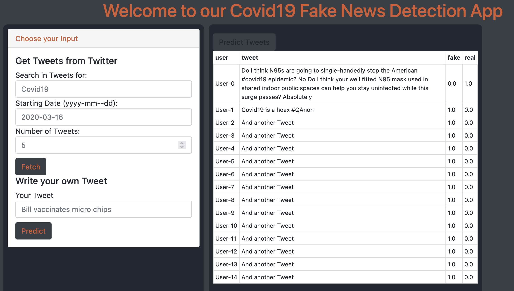

# Fake Covid App
This file contains an installation guid to setup and run the fakecovapp.
Before you can run the web app you must train or download a model and make some changes to the config `3. Config`.
In case you want to predict tweets, you must provide credentials for the Twitter API, too.

Overview:
1. [Install](#1.-Install)
2. [Run](#2.-Run)
3. [Config](#3.-Config)



## 1. Install
1. Setup new environment via python venv or anaconda:
python
```
python3 -m venv myvenv
```
anaconda
```shell
conda create --name myenv
```
2. Activate your venv:
python venv
```shell
source /path/to/venv/bin/activate
```
or via anaconda
```
conda activate /path/to/condavenv/
```
3. Install requirements:
````shell
pip install -r /path/to/requirements.txt
````
## 2. Run
1. Make sure you either did download the complete model from GoogleDrive or trained and saved the model with the `Fake-News-and-Disinformation-related-to-COVID-19/train/train.ipynb` notebook.
2. Before you can run the app properly with the model and twitter you have to make changes in the config. See `3. Config`.
3. Activate venv (see 1.2)
4. Move to directory
```shell
cd /your/dir/FakeNewsDetectionSystem/fakecovapp
```
3. Run app
```shell
python app.py -c /path/to/config.json
```
## 3. Config
You can find and use the example config `Fake-News-and-Disinformation-related-to-COVID-19/FakeNewsDetectionSystem/fakecovapp/fakecov_config.json`.
But make sure that you change the following values according to the documented config below:

VALUES TO BE CHANGED: `base_path`, `model_path`, `tokenizer_path`, `data_path` and all values for the `tweepy` section!
````json
{
  "base_path": "/your/path/Fake-News-and-Disinformation-related-to-COVID-19/FakeNewsDectionSystem",
  "model": {
    "model_path": "/path/to/m1_model",
    "INPUT_SHAPE": 150,
    "MAX_LEN": 512,
    "MAX_NB_WORDS": 29000,
    "MAX_SEQUENCE_LENGTH": 150,
    "HIDDEN_DIM": 150
  },
  "tokenizer_path": "/your/location/tokenizer.pkl",
  "model_data": {
    "data_path": "/your/location/FakeDetection.pkl"
  },
  "tweepy": {
    "CONSUMER_KEY": "YOUR-KEY",
    "CONSUMER_SECRET": "YOUR-KEY",
    "ACCESS_TOKEN": "YOUR-KEY",
    "ACCESS_TOKEN_SECRET": "YOUR-KEY"
  }
}
````